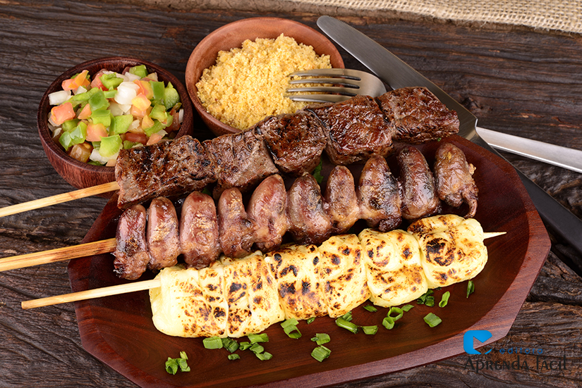
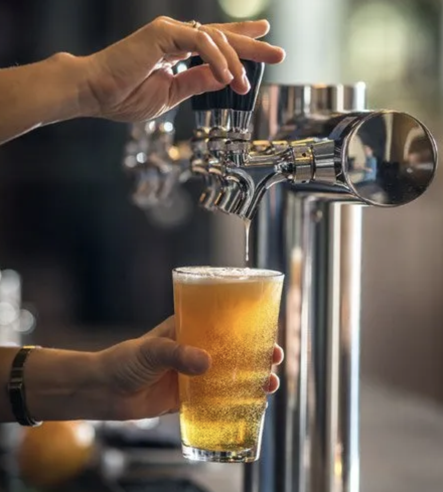
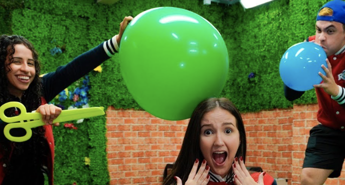

<html lang="pt-BR">
<head>
    <meta charset="UTF-8">
    <meta name="viewport" content="width=device-width, initial-scale=1.0, minimum-scale=1.0, maximum-scale=1.0, user-scalable=no">
    <meta http-equiv="X-UA-Compatible" content="IE=edge">
    <meta name="HandheldFriendly" content="true">
    <meta name="MobileOptimized" content="width">
    <meta name="theme-color" content="#ff66b2">
    <meta name="format-detection" content="telephone=no">
    <title>Festa da Katharyna - Bar Pub Night Girl</title>
    <link href="https://fonts.googleapis.com/css2?family=Bebas+Neue&family=Dancing+Script:wght@700&family=Roboto:wght@400;700&display=swap" rel="stylesheet">
    <link rel="stylesheet" href="https://cdnjs.cloudflare.com/ajax/libs/font-awesome/5.15.3/css/all.min.css">
    
</head>
<body>
    

        <header>
            <h1>✨ Venha para a minha festa! ✨</h1>
            <h2>no Playground!</h2>
            
Vai ser épico, só alegria e drinks!

        </header>

        

            <h3>🍖 O QUE ROLA:</h3>
            <ul>
                <li><strong>CHURRASCO COMPARTILHADO</strong> - Tragam 500g de carne ou qualquer coisa de churrasco</li>
                                 
                <li><strong>PETISCOS</strong> - Vai ter umas gostosuras pra acompanhar</li>
                <li><strong>PLAYLIST ANIMADA</strong> - Só sucessos pra agitar! Sugestões de música? Pode ser Pop, Rock, nacionais ou internacionais, ou o que desejar! Mande mensagem</li>
            </ul>
           
        

 

            <h3>🍺 CHOPEIRA GRÁTIS!</h3>
            

                
                

                    
<strong>Vai ter Chopeira 0800! Então não precisa levar bebida, a não ser que você beba outra coisa!</strong>
 
Só tragam 500g de carne ou qualquer coisa de churrasco, que iremos colocar uma carninha.
 
<strong>Vai ter BEER PONG! - Preparem-se para a competição!</strong>

                

            

            

Se estiver apertado, não deixa de vir! O importante é a presença! 😘

        

        

    

        

            <h3>Você pensou que ia faltar, né?</h3>
            <ul>
                <li><strong>BALÃO SUPRESA!</strong> - lembra aqueles de festa? Vai ter que estourar! 🥳 kkkkk</li>
                 
                
                

                    

Venha curtir, sorrir!

                

            </ul>
        

        

            <h3>👗 DRESS CODE:</h3>
            <ul>
                <li><strong>Seja você mesmo!</strong> Venha confortável e no seu estilo</li>
                <li><strong>Opcional:</strong> Se quiser arrasar, vai de look noturno!</li>
            </ul>
        

 

            <h3>📅 QUANDO:</h3>
            
🗓️ <strong>Sábado, 26 de julho</strong>

            
⏰ <strong>A partir das 13h, rolando até às 21 horas </strong>

        

        

            <h3>📍 ONDE VAI SER? EM COPACABANA!</h3>
            
Rua Santa Clara 431 - Copacabana, Rio de Janeiro

            
            

                <iframe src="https://www.google.com/maps/embed?pb=!1m18!1m12!1m3!1d3673.254216178014!2d-43.18668892432058!3d-22.97055504024793!2m3!1f0!2f0!3f0!3m2!1i1024!2i768!4f13.1!3m3!1m2!1s0x9bd544d245819d%3A0x5c35a3f5a5f6b5a4!2sRua%20Santa%20Clara%2C%20431%20-%20Copacabana%2C%20Rio%20de%20Janeiro%20-%20RJ!5e0!3m2!1spt-BR!2sbr!4v1620000000000!5m2!1spt-BR!2sbr" allowfullscreen="" loading="lazy"></iframe>
            

        

        
        

        

            <h3>📞 CONFIRMAÇÃO:</h3>
            
Vai ter que rolar confirmação, hein! Me avisa até 25 de julho!

            <a href="https://wa.me/5521988457601?text=Eu%20vou%20na%20sua%20festa,%20Katharyna!" class="whatsapp-btn" target="_blank">
                <i class="fab fa-whatsapp"></i> Confirmar Presença
            </a>
            
            

                <form id="confirmacaoForm">
                    

                        <label for="nome">Seu Nome:</label>
                        <input type="text" id="nome" name="nome" required>
                    

                    
                    

                        <label for="telefone">Telefone:</label>
                        <input type="tel" id="telefone" name="telefone" required>
                    

                    
                    

                        <label for="mensagem">Mensagem (opcional):</label>
                        <textarea id="mensagem" name="mensagem" placeholder="Ex: Vou levar carne, frango, linguiça! Vegano! Coloca a minha música! Posso levar amigo(a)? Ou: Não posso faltar!"></textarea>
                    

                    
                    <button type="submit" class="submit-btn">ENVIAR CONFIRMAÇÃO</button>
                </form>
            

        

       

        <footer>
            
💃 ÚLTIMA CHAMADA: Vamos pular!

             
             
             
             
            
Developed by <a href="https://www.instagram.com/andherssonkaethanno/" target="_blank">Andy</a>

        </footer>
    

    
</body>
</html>
